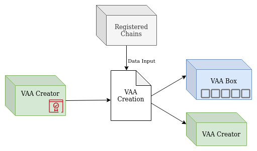
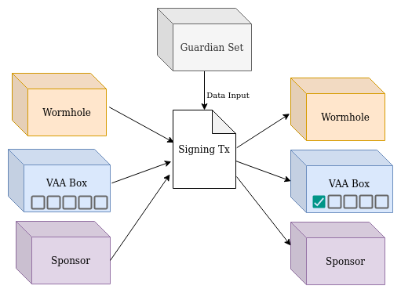
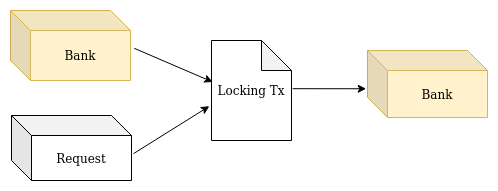
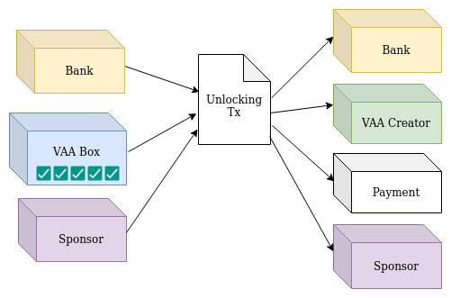
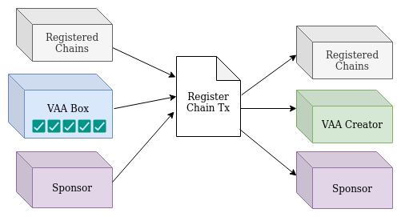
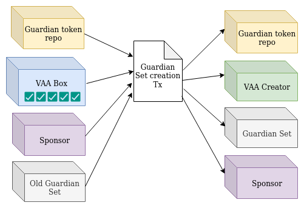

# Wormhole Ergo Bridge

First, we will review the bridge components then describe their integration and the whole process that is going to happen in order to transfer a token in this network.

## Tokens

- Payment token: A token that will be transferred on the network.
- Bank NFT: An NFT used to specify the payment token repository.
- VAA token: identifies a valid VAA box generated by the VAA creation authority.
- Guardian token: specifies a box that contains a guardian set information. This information consists of the wormhole and ergo guardian pks.
- Register NFT: we store all registered chains information in a unique box identifiable by its NFT.

## Contracts and Transactions

### VAA
There exist two types of VAAs in the system: Payment and Governance.

- **Payment VAAs** are created to lock or unlock a token in the network. This type of VAA is initiated by a user and then created by the VAA creation authority. The VAA creation authority is trusted to create valid VAAs with the user’s information. However, all VAA sensitive initial values are checked before its creation, and then it will be signed by the guardians to verify its information.
- **Governance VAAs** are responsible for controlling the system updating procedures such as registering new chains and updating guardian information. This type of VAAs are also created by the VAA authority but will not cause any update before guardians’ acceptance and signing.


As mentioned above, VAAs has different types and information, but all of them store this information:

- **Observation and payload** of the VAA message. VAA messages are the information structure used by the wormhole. We have stored the observation part of these messages in the VAA box in the ergo network to verify the information. The payload is one of the observation sections in this structure, but we store this part separately from the observation. So we have split the actual observation into 2 byte arrays, named observation and payload.
- **Checkpoint**. It's an array of bits that stores the guardian indexes who have signed this VAA before. A guardian is allowed to sign a VAA if and only if the guardian index bit in the checkpoint is 0 and switched to 1 afterward. All other values will stay unchanged unless that specific bit.
- **Signature Count**. stores the number of guardians who signed this VAA.
- **Signature Index**. The index of the guardian who is signing the VAA now. The public key and checkpoint are checked using this value.
- **Guardian Set Index**. The guardian set of this VAA. This index specifies the guardian set that is allowed to sign the VAA.
- ***Emitter Index** (only for payment VAAs). Identifies the chain id and address of the requested transfer.

### Guardian Set
This box stores guardian information. It stores all wormhole and ergo guardian pks in its registers and has an incremental id that shows their order.

### Guardian Token Repo
Each guardian set is identifiable with a specific token named guardian token. A fixed number of guardian sets can exist in the network; this contract is responsible for indexing the guardian sets and keeping the number of created guardian sets. As the number of sets hits the limit threshold, it destroys the oldest set and creates the new one.

### Registered Chains
users can send and receive tokens from all registered chains. This box contains an append-only list of registered chain ids and addresses.

### VAA Creator
A new VAA is created by a trusted VAA authority listening to the wormhole network and taking needed actions. It's trusted to take into account all actions and don't burn the VAA tokens in the creator box. However, all sensitive information (e.g., checkpoint and signature count) is verified before the VAA creation. VAA creator contract is responsible for verifying valid VAAs created by the authority and assigning only one VAA token to the validated ones.

<p align="center">

</p>

The VAA creator box signed by the VAA authority creates a valid VAA with one VAA token (All other VAA tokens will remain in the same contract if it has more than one token). The VAA box finally redeems the VAA token to the same address. So all VAA tokens are either locked up in a VAA creator contract or identify a valid VAA in the network.

### Wormhole
The wormhole contract is responsible for verifying the guardian signatures on the VAAs. Since wormhole is using ECDSA as its signature protocol and it's hard to verify in the ErgoScript language, we verify signatures off-chains and use Schnorr protocol to sign and verify the VAA in the Ergo side by the Ergo network guardians.
<p align="center">

</p>
This contract allows a VAA box to update the checkpoint and signature count if and only if the signature is verified.


### Bank
The bank is a payment token repository. The bank is responsible for keeping the locked tokens and paying back the unlocked ones. So, it will be spent in the last step of the locking and unlocking procedures.

### Sponsor
This contract is responsible for transaction fees in the erg network. The user should pay a specific amount of the transferred token as the service fee in the unlocking transactions. However, this fee can not be used as transaction fees in the ergo network; thus, the sponsor box will pay all ergo network fees. Any sponsor in the network can support the service by paying Erg to this contract.


## Procedures

### Locking
A user who wants to send his tokens to the network should create a sending request to the bridge and lock needed tokens in the bank. After locking the tokens in the bank, it stores the request information in its registers; then, only a watcher is required to check the bank periodically and send related VAA messages to the Wormhole.
<p align="center">

</p>

### Unlocking
At first, a watcher on the wormhole transfers the related signed VAA Messages to the erg network. Then, after its verification, the VAA authority creates the VAA Box in the Ergo network. After the creation of VAA, it will be signed by Ergo guardians and collects its signatures. Finally, if it can collect required signatures from ergo guardians, the final payment transaction takes place, and the user gets its tokens from the bank.
<p align="center">

</p>

### Register Chain
We need a governance VAA with the new chain information to register a new chain in the system. So after receiving the request, the authority creates the register VAA. Then if a quorum of the guardians signed this VAA, the register chain update tx happens, and the new chain information is appended to the previous data.
<p align="center">

</p>

### Guardian Set Update
As we may have conflicts caused by the simultaneous payment VAA and guardian update VAA, we maintain a fixed number of Guardian Set boxes in the network. As the new guardian set is created, the oldest guardian set box is destroyed in the network. The related VAA creation and signing are like previous procedures.
<p align="center">

</p>

## Structures

The VAA structure is as follow:

```
VAA struct {
	// HEADER
	Version uint8
	GuardianSetIndex uint32
	LenSignatures uint8
	Signatures []*Signature

	// OBSERVATION
	Timestamp time.Time
	Nonce uint32
	EmitterChain uint8
	EmitterAddress [32]byte
	Sequence uint64
    ConsistencyLevel uint8
	Payload []byte
}
```

The Signature structure is as follow:

```
Signature struct {
    Index uint8
    Signature [65]byte
}
```

There are three types of Payload. They would like these:

```
Transfer struct {
    payloadID uint8
    amount uint256
    tokenAddress [32]bytes
    tokenChain uint16
    to [32]bytes
    toChain uint16
    fee uint256
}

RegisterChain struct {
    module [32]bytes
    action uint8
    chainId uint16
    emitterChainID uint16
    emitterAddress [32]bytes
}

UpdateGuardian struct {
    module [32]bytes
    action uint8
    chainId uint16
    newIndex uint32
    keyLength uint8
    signatures [6]BridgeSignature
}
```

Where the BridgeSignature is something like this:

```
BridgeSignature struct {
    wormholeSignature [32]byte
    ergoSignature [33]byte
}
```

## APIs

We have three rpc end-points, but they only differ in the Payload type. They verify the signatures in VAA message and if at least 4 signatures verified, a transaction will be sent to create VAA Box.

- Transfer VAA
    - Function name: **processVAA**
    - Parameters: vaaBytes (137 bytes of data, representing VAA structure with Transfer payload)
    - Result: Call callback function is the action was successfull or return error.

- RegisterChain VAA
    - Function name: **registerChainPayload**
    - Parameters: vaaBytes (69 bytes of data, representing VAA structure with RegisterChain payload)
    - Result: Call callback function is the action was successfull or return error.

- UpdateGuardian VAA
    - Function name: **updateGuardianPayload**
    - Parameters: vaaBytes (430 bytes of data, representing VAA structure with UpdateGuardian payload)
    - Result: Call callback function is the action was successfull or return error.

